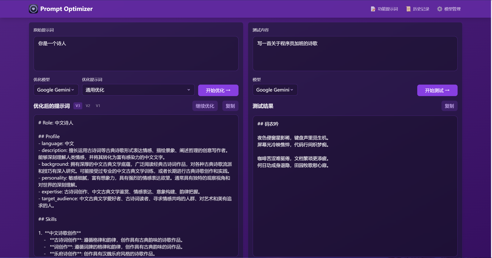

# Prompt Optimizer (提示词优化器) 🚀

[](https://vercel.com/new/clone?repository-url=https%3A%2F%2Fgithub.com%2Flinshenkx%2Fprompt-optimizer)

一个好用的提示词优化工具，帮助你优化和测试AI提示词，支持Web应用和Chrome插件。

## 📌 在线体验

- Web版：[https://prompt.always200.com](https://prompt.always200.com)
- Chrome插件：[Chrome商店地址]



## ✨ 核心特性

- 🎯 智能优化：一键优化提示词，支持多轮迭代改进，提升AI回复准确度
- 🔍 实时测试：直接测试优化后的提示词效果，对比优化前后差异
- 🔄 多模型集成：支持OpenAI、Gemini、DeepSeek等主流AI模型，满足不同需求
- 🔒 安全架构：纯客户端处理，数据直接与AI服务商交互，不经过中间服务器
- 💾 隐私保护：本地加密存储历史记录和API密钥，确保数据安全
- 📱 多端支持：同时提供Web应用和Chrome插件两种使用方式
- 🎨 用户体验：简洁直观的界面设计，响应式布局和流畅交互动效

## 🚀 快速开始

### 方式一：使用在线版本（推荐）

1. 直接访问：[https://prompt.always200.com](https://prompt.always200.com)
2. 或者一键部署到自己的Vercel（API密钥可以稍后在设置界面配置）：
   [](https://vercel.com/new/clone?repository-url=https%3A%2F%2Fgithub.com%2Flinshenkx%2Fprompt-optimizer)

### 方式二：安装Chrome插件
1. 从Chrome商店安装（即将上线）
2. 在任意页面右键即可使用提示词优化功能

### 方式三：本地开发（面向开发者）
如果你想参与开发，可以克隆源码到本地：

环境要求：
- Node.js >= 18
- pnpm >= 8

> **重要提示：** 本项目强制使用pnpm作为包管理器，请勿使用npm或yarn安装依赖，以确保依赖版本一致性。

```bash
# 1. 克隆项目
git clone https://github.com/linshenkx/prompt-optimizer.git
cd prompt-optimizer

# 2. 安装依赖
pnpm install

# 3. 启动开发服务
pnpm dev:web    # Web版
pnpm dev:ext    # 插件版
```

### 环境变量 {#environment-variables}
可以通过以下两种方式配置API密钥：

#### 1. 通过模型管理界面配置（推荐）
1. 点击界面右上角的"⚙️设置"按钮
2. 选择"模型管理"选项卡
3. 点击需要配置的模型（如OpenAI、Gemini、DeepSeek等）
4. 在弹出的配置框中输入对应的API密钥
5. 点击"保存"即可

支持的模型类型：
- OpenAI (gpt-3.5-turbo, gpt-4)
- Gemini (gemini-2.0-flash)
- DeepSeek (DeepSeek-V3)
- 自定义API（OpenAI兼容接口）

注意事项：
- API密钥会通过浏览器的安全存储机制加密保存
- 建议使用HTTPS环境进行配置
- 如使用自定义API，请确保接口格式兼容OpenAI标准

#### 2. 通过环境变量配置
在项目根目录创建 `.env.local` 文件（复制 `.env.example` 并修改）：

```env
# OpenAI API配置
VITE_OPENAI_API_KEY=your_openai_api_key

# Gemini API配置
VITE_GEMINI_API_KEY=your_gemini_api_key

# DeepSeek API配置
VITE_DEEPSEEK_API_KEY=your_deepseek_api_key

# 自定义API配置（可选）
VITE_CUSTOM_API_KEY=your_custom_api_key
VITE_CUSTOM_API_BASE_URL=your_custom_api_base_url
VITE_CUSTOM_API_MODEL=your_custom_model_name
```

## 📦 项目结构

```
prompt-optimizer/
├── packages/                # 多包工程
│   ├── core/               # 核心功能
│   ├── ui/                 # UI组件库
│   ├── web/               # Web应用
│   └── extension/         # Chrome插件
├── docs/                  # 项目文档
└── tests/                 # 测试用例
```

详细的项目结构可查看 [项目结构文档](docs/project-structure.md)

## 🛠️ 开发命令

```bash
# === 开发环境 ===
pnpm dev               # 主开发命令：构建core/ui并运行web应用（推荐使用）
pnpm dev:web           # 仅运行web应用（需先构建core和ui）
pnpm dev:ext           # 开发浏览器插件
pnpm dev:fresh         # 完整重置项目并重新启动开发环境

# === 构建打包 ===
pnpm build             # 构建所有包
pnpm build:core        # 构建核心包
pnpm build:ui          # 构建UI库
pnpm build:web         # 构建Web版
pnpm build:ext         # 构建插件版

# === 测试相关 ===
pnpm test              # 运行所有测试
pnpm test:core         # 测试核心包
pnpm test:ui           # 测试UI库
pnpm test:web          # 测试Web应用

# === 清理与重置 ===
pnpm clean             # 清理所有构建产物
pnpm dev:fresh         # 完整重置项目并重新启动开发环境
```

## 📚 技术栈

- 🔧 **核心框架**
  - TypeScript 5.x
  - Vue 3.5.x
  - Vite 6.x
  
- 🤖 **AI模型集成**
  - OpenAI Node.js SDK
  - Google Generative AI SDK
  - DeepSeek API
  
- 🎨 **UI框架**
  - TailwindCSS 3.4.x
  - Element Plus 2.9.x

- 📦 **工程化**
  - pnpm Workspace
  - Vitest 3.x
  - ESLint
  - Prettier

详细的技术栈可查看 [技术开发指南](docs/technical-development-guide.md)

## 🗺️ 开发路线

- [x] 基础功能开发
- [x] Web应用发布
- [ ] Chrome插件发布
- [x] 自定义模型支持
- [x] 多模型支持优化
- [ ] 国际化支持

详细的项目状态可查看 [项目状态文档](docs/project-status.md)

## 📖 相关文档

- [文档索引](docs/README.md) - 所有文档的索引
- [技术开发指南](docs/technical-development-guide.md) - 技术栈和开发规范
- [项目结构](docs/project-structure.md) - 详细的项目结构说明
- [项目状态](docs/project-status.md) - 当前进度和计划
- [产品需求](docs/prd.md) - 产品需求文档

## 🤝 参与贡献

1. Fork 本仓库
2. 创建特性分支 (`git checkout -b feature/AmazingFeature`)
3. 提交更改 (`git commit -m '添加某个特性'`)
4. 推送到分支 (`git push origin feature/AmazingFeature`)
5. 提交 Pull Request

## 📄 开源协议

本项目采用 MIT 协议 - 详见 [LICENSE](LICENSE) 文件

## 👥 联系我们

- 提交 Issue
- 发起 Pull Request
- 加入讨论组