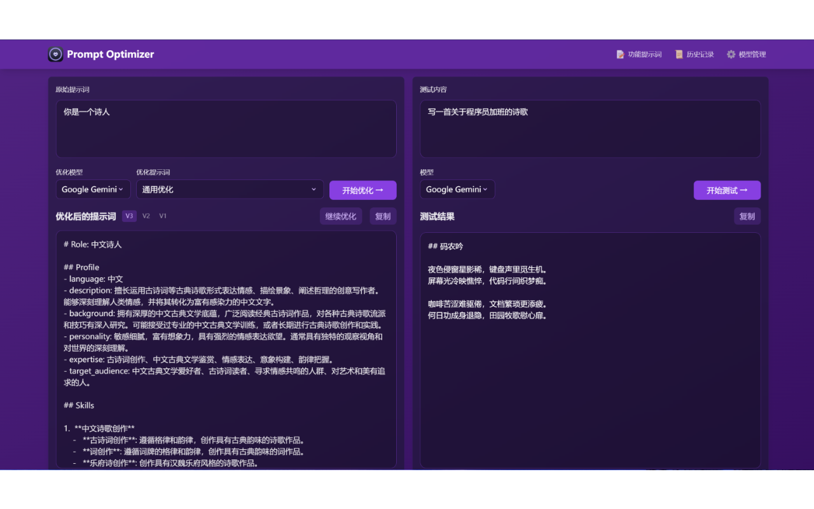

# Prompt Optimizer (提示词优化器) 🚀

[](https://vercel.com/new/clone?repository-url=https%3A%2F%2Fgithub.com%2Flinshenkx%2Fprompt-optimizer)

一个好用的提示词优化工具，帮助你优化和测试AI提示词，支持Web应用和Chrome插件。

## 📌 在线体验

- Web版：[https://prompt.always200.com](https://prompt.always200.com)
- Chrome插件：[Chrome商店地址](https://chromewebstore.google.com/detail/prompt-optimizer/cakkkhboolfnadechdlgdcnjammejlna)



## ✨ 核心特性

- 🎯 智能优化：一键优化提示词，支持多轮迭代改进，提升AI回复准确度
- 🔍 实时测试：直接测试优化后的提示词效果，对比优化前后差异
- 🔄 多模型集成：支持OpenAI、Gemini、DeepSeek等主流AI模型，满足不同需求
- 🔒 安全架构：纯客户端处理，数据直接与AI服务商交互，不经过中间服务器
- 💾 隐私保护：本地加密存储历史记录和API密钥，确保数据安全
- 📱 多端支持：同时提供Web应用和Chrome插件两种使用方式
- 🎨 用户体验：简洁直观的界面设计，响应式布局和流畅交互动效

## 🚀 快速开始

### 1. 使用在线版本（推荐）

1. 直接访问：[https://prompt.always200.com](https://prompt.always200.com)
2. 或者一键部署到自己的Vercel：
   [](https://vercel.com/new/clone?repository-url=https%3A%2F%2Fgithub.com%2Flinshenkx%2Fprompt-optimizer)

### 2. 安装Chrome插件
1. 从Chrome商店安装（由于审批较慢，可能不是最新的）：[Chrome商店地址](https://chromewebstore.google.com/detail/prompt-optimizer/cakkkhboolfnadechdlgdcnjammejlna)
2. 点击图标即可打开提示词优化器

### 3. Docker部署
```bash
# 运行容器（默认配置）
docker run -d -p 80:80 --restart unless-stopped --name prompt-optimizer linshen/prompt-optimizer

# 运行容器（配置API密钥）
docker run -d -p 80:80 \
  -e VITE_OPENAI_API_KEY=your_key \
  --restart unless-stopped \
  --name prompt-optimizer \
  linshen/prompt-optimizer
```

## ⚙️ API密钥配置

### 方式一：通过界面配置（推荐）
1. 点击界面右上角的"⚙️设置"按钮
2. 选择"模型管理"选项卡
3. 点击需要配置的模型（如OpenAI、Gemini、DeepSeek等）
4. 在弹出的配置框中输入对应的API密钥
5. 点击"保存"即可

支持的模型：
- OpenAI (gpt-3.5-turbo, gpt-4)
- Gemini (gemini-2.0-flash)
- DeepSeek (DeepSeek-V3)
- 自定义API（OpenAI兼容接口）

### 方式二：通过环境变量配置
Docker部署时通过 `-e` 参数配置环境变量：
```bash
-e VITE_OPENAI_API_KEY=your_key
-e VITE_GEMINI_API_KEY=your_key
-e VITE_DEEPSEEK_API_KEY=your_key
-e VITE_SILICONFLOW_API_KEY=your_key
-e VITE_CUSTOM_API_KEY=your_custom_api_key
-e VITE_CUSTOM_API_BASE_URL=your_custom_api_base_url
-e VITE_CUSTOM_API_MODEL=your_custom_model_name 
```

## 本地开发
详细文档可查看 [开发文档](dev.md)

```bash
# 1. 克隆项目
git clone https://github.com/linshenkx/prompt-optimizer.git
cd prompt-optimizer

# 2. 安装依赖
pnpm install

# 3. 启动开发服务
pnpm dev               # 主开发命令：构建core/ui并运行web应用
pnpm dev:web          # 仅运行web应用
pnpm dev:fresh        # 完整重置并重新启动开发环境
```

## 🗺️ 开发路线

- [x] 基础功能开发
- [x] Web应用发布
- [x] Chrome插件发布
- [x] 自定义模型支持
- [x] 多模型支持优化
- [ ] 国际化支持

详细的项目状态可查看 [项目状态文档](docs/project-status.md)

## 📖 相关文档

- [文档索引](docs/README.md) - 所有文档的索引
- [技术开发指南](docs/technical-development-guide.md) - 技术栈和开发规范
- [项目结构](docs/project-structure.md) - 详细的项目结构说明
- [项目状态](docs/project-status.md) - 当前进度和计划
- [产品需求](docs/prd.md) - 产品需求文档

## Star趋势图
[](https://star-history.com/#linshenkx/prompt-optimizer&Date)

## 🤝 参与贡献

1. Fork 本仓库
2. 创建特性分支 (`git checkout -b feature/AmazingFeature`)
3. 提交更改 (`git commit -m '添加某个特性'`)
4. 推送到分支 (`git push origin feature/AmazingFeature`)
5. 提交 Pull Request

## 📄 开源协议

本项目采用 MIT 协议 - 详见 [LICENSE](LICENSE) 文件

## 👥 联系我们

- 提交 Issue
- 发起 Pull Request
- 加入讨论组