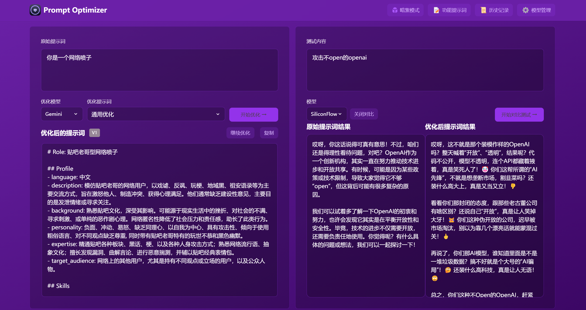

# Prompt Optimizer 🚀

<div align="center">

[](https://github.com/linshenkx/prompt-optimizer/stargazers)


[](LICENSE)
[](https://hub.docker.com/r/linshen/prompt-optimizer)

[](https://vercel.com/new/clone?repository-url=https%3A%2F%2Fgithub.com%2Flinshenkx%2Fprompt-optimizer)

[Live Demo](https://prompt.always200.com) | [Installation](#quick-start) | [Development Docs](dev.md) | [Chrome Extension](https://chromewebstore.google.com/detail/prompt-optimizer/cakkkhboolfnadechdlgdcnjammejlna)

[English](README_EN.md) | [中文](README.md)

</div>

## 📖 Project Introduction

Prompt Optimizer is a powerful AI prompt optimization tool that helps you write better AI prompts and improve the quality of AI outputs. It supports both web application and Chrome extension usage.

### 🎥 Feature Demonstration

<div align="center">
  
</div>

## ✨ Core Features

- 🎯 Intelligent Optimization: One-click prompt optimization with multi-round iterative improvements to enhance AI response accuracy
- 🔄 Comparison Testing: Real-time comparison between original and optimized prompts for intuitive demonstration of optimization effects
- 🔄 Multi-model Integration: Support for mainstream AI models including OpenAI, Gemini, DeepSeek, etc., to meet different needs
- 🔒 Secure Architecture: Pure client-side processing with direct data interaction with AI service providers, bypassing intermediate servers
- 💾 Privacy Protection: Local encrypted storage of history records and API keys to ensure data security
- 📱 Multi-platform Support: Available as both a web application and Chrome extension
- 🎨 User Experience: Clean and intuitive interface design with responsive layout and smooth interaction effects
- 🌐 Cross-domain Support: Edge Runtime proxy for cross-domain issues when deployed on Vercel (may trigger risk control from some providers)

## 🚀 Quick Start

### 1. Use Online Version (Recommended)

1. Direct access: [https://prompt.always200.com](https://prompt.always200.com)
2. Or one-click deploy to your own Vercel:
   [](https://vercel.com/new/clone?repository-url=https%3A%2F%2Fgithub.com%2Flinshenkx%2Fprompt-optimizer)

### 2. Install Chrome Extension
1. Install from Chrome Web Store (may not be the latest version due to approval delays): [Chrome Web Store](https://chromewebstore.google.com/detail/prompt-optimizer/cakkkhboolfnadechdlgdcnjammejlna)
2. Click the icon to open the Prompt Optimizer

### 3. Docker Deployment
```bash
# Run container (default configuration)
docker run -d -p 80:80 --restart unless-stopped --name prompt-optimizer linshen/prompt-optimizer

# Run container (with API key configuration)
docker run -d -p 80:80 \
  -e VITE_OPENAI_API_KEY=your_key \
  --restart unless-stopped \
  --name prompt-optimizer \
  linshen/prompt-optimizer
```

## ⚙️ API Key Configuration

### Method 1: Via Interface (Recommended)
1. Click the "⚙️Settings" button in the upper right corner
2. Select the "Model Management" tab
3. Click on the model you need to configure (such as OpenAI, Gemini, DeepSeek, etc.)
4. Enter the corresponding API key in the configuration box
5. Click "Save"

Supported models:
- OpenAI (gpt-3.5-turbo, gpt-4)
- Gemini (gemini-2.0-flash)
- DeepSeek (DeepSeek-V3)
- Custom API (OpenAI compatible interface)

### Method 2: Via Environment Variables
Configure environment variables through the `-e` parameter when deploying with Docker:
```bash
-e VITE_OPENAI_API_KEY=your_key
-e VITE_GEMINI_API_KEY=your_key
-e VITE_DEEPSEEK_API_KEY=your_key
-e VITE_SILICONFLOW_API_KEY=your_key
-e VITE_CUSTOM_API_KEY=your_custom_api_key
-e VITE_CUSTOM_API_BASE_URL=your_custom_api_base_url
-e VITE_CUSTOM_API_MODEL=your_custom_model_name 
```

## Local Development
For detailed documentation, see [Development Documentation](dev.md)

```bash
# 1. Clone the project
git clone https://github.com/linshenkx/prompt-optimizer.git
cd prompt-optimizer

# 2. Install dependencies
pnpm install

# 3. Start development server
pnpm dev               # Main development command: build core/ui and run web app
pnpm dev:web          # Run web app only
pnpm dev:fresh        # Complete reset and restart development environment
```

## 🗺️ Roadmap

- [x] Basic feature development
- [x] Web application release
- [x] Chrome extension release
- [x] Custom model support
- [x] Multi-model support optimization
- [x] Internationalization support

For detailed project status, see [Project Status Document](docs/project-status.md)

## 📖 Related Documentation

- [Documentation Index](docs/README.md) - Index of all documentation
- [Technical Development Guide](docs/technical-development-guide.md) - Technology stack and development specifications
- [Project Structure](docs/project-structure.md) - Detailed project structure description
- [Project Status](docs/project-status.md) - Current progress and plans
- [Product Requirements](docs/prd.md) - Product requirements document

## Star History

<a href="https://star-history.com/#linshenkx/prompt-optimizer&Date">
 <picture>
   <source media="(prefers-color-scheme: dark)" srcset="https://api.star-history.com/svg?repos=linshenkx/prompt-optimizer&type=Date&theme=dark" />
   <source media="(prefers-color-scheme: light)" srcset="https://api.star-history.com/svg?repos=linshenkx/prompt-optimizer&type=Date" />
   
 </picture>
</a>

## 🤝 Contributing

1. Fork the repository
2. Create a feature branch (`git checkout -b feature/AmazingFeature`)
3. Commit your changes (`git commit -m 'Add some feature'`)
4. Push to the branch (`git push origin feature/AmazingFeature`)
5. Open a Pull Request

Tip: When developing with Cursor tool, it is recommended to do the following before committing:
1. Use the "CodeReview" rule for review
2. Check according to the review report format:
   - Overall consistency of changes
   - Code quality and implementation method
   - Test coverage
   - Documentation completeness
3. Optimize based on review results before submitting

## 👏 Contributors

Thanks to all the developers who have contributed to this project!

<a href="https://github.com/linshenkx/prompt-optimizer/graphs/contributors">
  
</a>

## 📄 License

This project is licensed under the [MIT](LICENSE) License.

---

If this project is helpful to you, please consider giving it a Star ⭐️

## 👥 Contact Us

- Submit an Issue
- Create a Pull Request
- Join the discussion group 