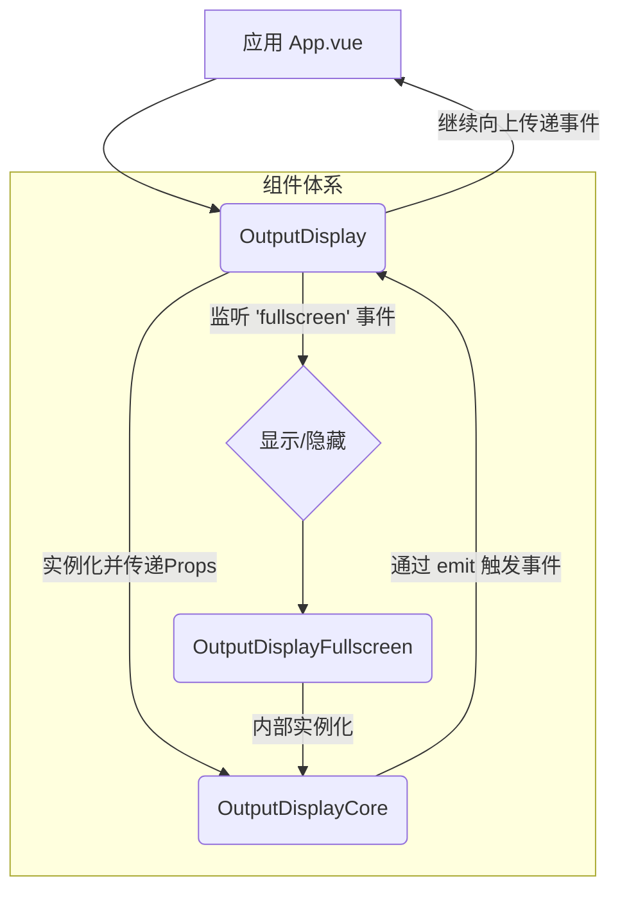

# OutputDisplay 组件体系设计文档

## 1. 概述

**OutputDisplay** 是一个通用的、模块化的内容输出组件体系，旨在统一管理系统中所有内容输出区域的显示和交互。它由一组分工明确的组件构成，共同解决样式不统一、交互分散、维护困难等问题。

### 组件体系构成

- **`OutputDisplay` (外观组件)**：作为整个体系的统一入口，供外部调用。它封装了核心显示逻辑和全屏功能，并向上传递事件。
- **`OutputDisplayCore` (核心引擎)**：实现所有核心的显示逻辑，包括只读/编辑/对比模式切换、推理内容管理、工具栏交互等。
- **`OutputDisplayFullscreen` (全屏封装)**：一个轻量级封装，结合 `FullscreenDialog` 和 `OutputDisplayCore` 提供沉浸式的全屏查看体验。

## 2. 设计目标

- **统一性**：提供一致的UI和交互体验。
- **复用性**：一个组件体系适配多种使用场景。
- **可维护性**：集中管理核心逻辑，降低耦合度。
- **扩展性**：通过配置支持不同功能组合。

## 3. 组件接口设计 (`OutputDisplayCore`)

核心引擎 `OutputDisplayCore` 是功能的主要提供者。

### Props 属性

```typescript
type ActionName = 'fullscreen' | 'diff' | 'copy' | 'edit' | 'reasoning';

interface OutputDisplayCoreProps {
  // === 内容相关 ===
  content?: string;                   // 主要内容（或对比模式下的新内容）
  originalContent?: string;           // 对比模式下的原始（旧）内容。**这是启用内置对比(diff)模式的前提**
  reasoning?: string;                 // 推理内容
  
  // === 显示模式 ===
  mode: 'readonly' | 'editable';      // 'readonly': 渲染Markdown; 'editable': 提供可编辑的textarea
  reasoningMode: 'show' | 'hide' | 'auto';  // 推理内容显示模式: 'show'-常驻, 'hide'-隐藏, 'auto'-有内容时自动显示
  
  // === 功能开关 ===
  // 通过此数组控制悬浮工具栏中显示哪些功能按钮。
  // 例如，当数组中包含 'diff' 且 `originalContent` prop 也被提供时，对比按钮才会出现。
  enabledActions?: ActionName[];      // e.g., ['copy', 'fullscreen', 'edit']
  
  // === 样式配置 ===
  height?: string | number;           // 内容区域高度, e.g., '100%' or 500
  placeholder?: string;               // 内容为空时的占位符文本
  
  // === 状态 ===
  loading?: boolean;                  // 加载状态，显示遮罩
  streaming?: boolean;                // 流式输出状态，显示流式指示器
}
```

### Events 事件

```typescript
interface OutputDisplayCoreEvents {
  'update:content': (content: string) => void;     // 在编辑模式下，内容发生变更时触发
  'update:reasoning': (reasoning: string) => void; // 推理内容更新时触发
  'copy': (content: string, type: 'content' | 'reasoning' | 'all') => void;  // 点击复制按钮时触发
  'fullscreen': () => void;                        // 点击全屏按钮时触发
  'edit-start': () => void;                        // 进入编辑模式时触发
  'edit-end': () => void;                          // 退出编辑模式时触发
  'reasoning-toggle': (expanded: boolean) => void; // 推理内容区域展开/折叠时触发
  'view-change': (mode: 'base' | 'diff') => void;  // 在内置的常规视图和对比视图之间切换时触发
}
```

## 4. 组件结构设计

### 4.1. 组件体系关系

`OutputDisplay` 外观组件是实际应用中应直接使用的组件。它内部管理 `OutputDisplayCore` 和 `OutputDisplayFullscreen` 的实例化和通信。



### 4.2. `OutputDisplayCore` 内部结构

核心组件根据不同的模式和状态，动态渲染其内部视图。

```
OutputDisplayCore
├── FloatingToolbar (悬浮工具栏, v-show="isHovering")
│   ├── ReasoningToggle (推理过程按钮)
│   ├── ViewModeToggle (文本/视图切换)
│   ├── DiffButton (对比按钮)
│   ├── CopyButton (复制按钮)
│   └── FullscreenButton (全屏按钮)
├── ReasoningSection (v-if="shouldShowReasoning")
│   └── MarkdownRenderer (渲染推理内容)
└── MainContent (flex: 1)
    ├── TextDiffUI (v-if="internalViewMode === 'diff'")
    ├── ReadonlyView (v-else-if="mode === 'readonly'")
    │   └── MarkdownRenderer (渲染主要内容)
    └── EditableView (v-else)
        ├── textarea (v-if="isEditing")
        └── MarkdownRenderer (v-else, 点击可编辑)
```

## 5. 功能特性

### 5.1. 推理内容管理 (`reasoning`)
- **智能显示**: 根据 `reasoningMode` 自动判断是否显示。
- **流式指示**: 在 `streaming` 状态下，若只有推理内容，会显示"生成中..."指示器。
- **独立复制**: 推理内容有独立的复制按钮。

### 5.2. 多视图模式
- **只读 (`readonly`)**: 使用 `MarkdownRenderer` 展示内容，支持代码高亮等富文本格式。
- **可编辑 (`editable`)**:
    - 默认显示渲染后的 `Markdown`。
    - 点击内容区域或切换按钮可进入 `textarea` 编辑模式。
    - 编辑内容通过 `update:content` 事件实时同步。
- **内置对比 (`diff`)**:
    - **激活机制**: 此模式并非由独立的prop控制，而是通过组合条件隐式激活。当`originalContent` prop被提供，且`enabledActions`数组包含`'diff'`时，用户界面上才会出现进入对比模式的按钮。
    - **功能**: 激活后，组件内部使用`TextDiffUI`来展示`content`与`originalContent`之间的差异。

### 5.3. 悬浮工具栏
- **按需显示**: `enabledActions` prop 控制显示哪些功能按钮。
- **情景可见**: 仅在鼠标悬浮在组件上时显示，保持界面整洁。
- **独立控制**: 每个按钮的可见性都与相关状态（如是否有内容可复制）绑定。

## 6. 使用场景与模式

### 6.1. 场景：优化结果展示与编辑

这是最完整的用例，展示了可编辑、可对比、带推理过程的优化结果。

```vue
<OutputDisplay
  :content="optimizedContent"
  :originalContent="originalPrompt"
  :reasoning="reasoningContent"
  mode="editable"
  :enabled-actions="['copy', 'fullscreen', 'edit', 'diff', 'reasoning']"
  title="优化后的提示词"
  placeholder="等待优化结果..."
  :streaming="isOptimizing"
  @update:content="handleContentUpdate"
/>
```

### 6.2. 场景：只读的测试结果

用于展示流式生成的测试结果，不可编辑。

```vue
<OutputDisplay
  :content="testResult"
  mode="readonly"
  :enabled-actions="['copy', 'fullscreen']"
  title="测试结果"
  placeholder="等待测试结果..."
  :streaming="isTesting"
/>
```

### 6.3. 模式：应用级对比布局

要并排对比两个不同的结果（例如，原始Prompt测试结果 vs 优化后Prompt测试结果），应使用**两个独立**的 `OutputDisplay` 组件。这并非组件的内置功能，而是一种应用层布局模式。

```vue
<div class="grid grid-cols-2 gap-4 h-full">
  <!-- 左侧：原始提示词测试结果 -->
  <OutputDisplay
    :content="originalTestResult"
    mode="readonly"
    title="原始提示词测试结果"
    :streaming="isTestingOriginal"
  />
  
  <!-- 右侧：优化后提示词测试结果 -->
  <OutputDisplay
    :content="optimizedTestResult"
    mode="readonly"
    title="优化后提示词测试结果"
    :streaming="isTestingOptimized"
  />
</div>
```
**优势**: 每个结果区域都是一个功能完整的组件，可以独立进行复制、全屏等操作。

## 7. 技术实现要点

- **状态驱动UI**: 组件的所有显示和交互都由Props和内部`ref`状态驱动，确保UI的可预测性。
- **逻辑封装**: `OutputDisplayCore` 封装了所有复杂的显示和交互逻辑，`OutputDisplay` 负责组合与门面，职责清晰。
- **实时同步**: 在编辑模式下，通过 `watch` 实时 `emit` 内容更新，确保了父组件状态的即时性，避免了数据不一致问题。

## 8. 迁移策略

项目已完成从旧有分散组件到 `OutputDisplay` 体系的迁移。所有内容输出区域（如 `PromptPanel`, `TestPanel`）均已使用此组件，实现了UI和交互的统一。未来的新功能也应基于此组件体系进行扩展。 