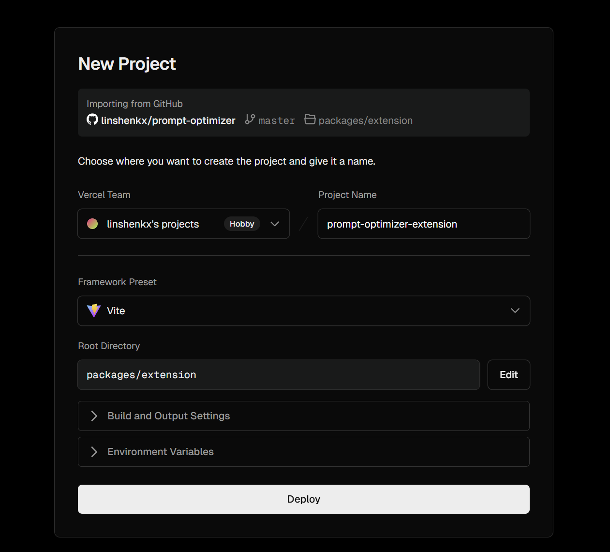
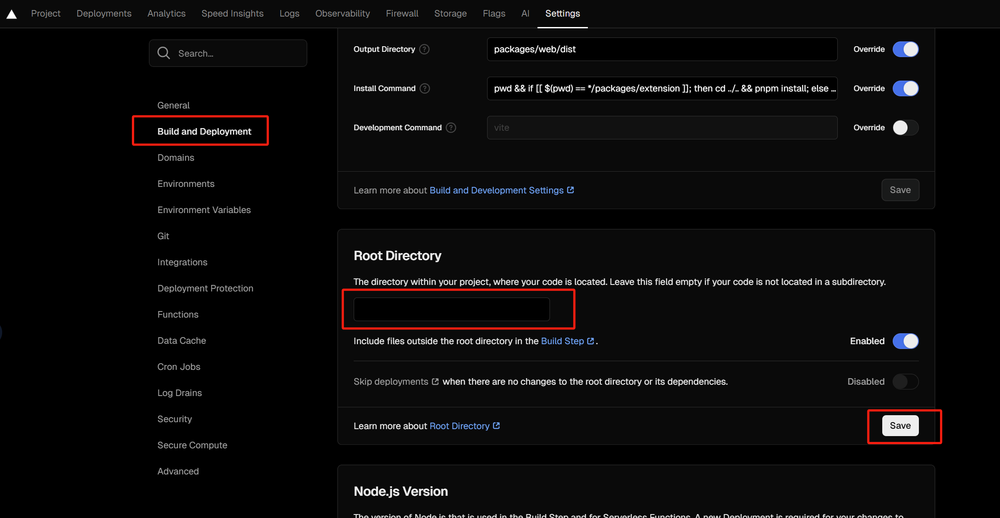
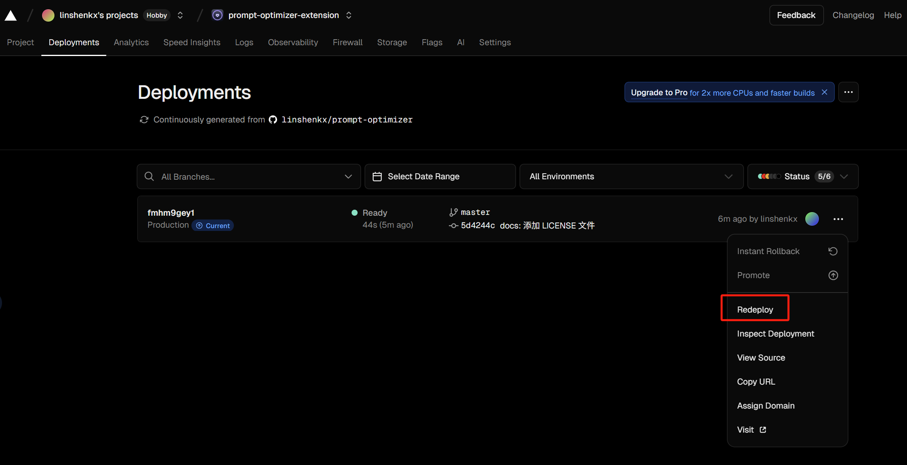

## Vercel 部署说明

### 部署方式对比

| 部署方式 | 优点 | 缺点 |
|---------|------|------|
| 一键部署 | 快速简便，无需额外设置 | 无法自动同步源项目更新 |
| Fork后导入 | 可跟踪源项目更新，更易维护 | 第一次部署需要手动修复根目录设置以启用Vercel代理功能 |

### 推荐方式：Fork项目后导入到Vercel（推荐）

这种方式可以让你跟踪项目更新，便于后续同步最新功能和bug修复。

1. **Fork项目到自己的GitHub**
   - 访问[prompt-optimizer项目](https://github.com/linshenkx/prompt-optimizer)
   - 点击右上角的"Fork"按钮
   - 完成fork操作后，你将在自己的GitHub账号下拥有此项目的副本

2. **导入项目到Vercel**
   - 登录[Vercel平台](https://vercel.com/)
   - 点击"Add New..."→"Project"
   - 在"Import Git Repository"部分找到你fork的项目并点击"Import"
   - 配置项目（**注意**：此处虽然可以设置根目录，但对多模块项目无效，仍需后续手动修复）
   - 点击"Deploy"开始部署

   

3. **修复根目录设置（强烈建议）**
   - 通过导入部署时，虽然项目的`vercel.json`文件已包含相关修复可以让基本功能正常工作
   - 但若要启用**Vercel代理功能**（解决跨域问题的关键功能），则需手动修复根目录：
   
   a. 在项目部署完成后，进入项目设置
   
   b. 点击左侧菜单中的"Build and Deployment"
   
   c. 在"Root Directory"部分，将输入框中的内容**清空**
   
   d. 点击"Save"保存设置
   
   

4. **重新部署项目**
   - 设置保存后，需要手动触发重新部署以使修复生效
   - 点击顶部导航栏中的"Deployments"
   - 在最新的部署记录右侧，点击"..."按钮
   - 选择"Redeploy"选项触发重新部署
   
   

5. **配置环境变量（可选）**
   - 部署完成后，进入项目设置
   - 点击"Environment Variables"
   - 添加需要的API密钥（例如`VITE_OPENAI_API_KEY`）
   - 重新部署项目使环境变量生效

6. **同步上游更新**
   - 在GitHub上打开你fork的项目
   - 如果有更新，会显示"This branch is X commits behind linshenkx:main"
   - 点击"Sync fork"按钮同步最新更改
   - Vercel会自动检测到代码变更并重新部署

### 替代方式：一键部署到Vercel

如果你只需要快速部署而不关心后续更新，可以使用一键部署方式：

1. 点击以下按钮直接部署到Vercel
   

2. 按照Vercel的引导完成部署流程
   
   **优势：** 一键部署方式Vercel能自动正确识别根目录，无需手动修复，所有功能（包括Vercel代理）均可正常使用。

### 关于Vercel代理功能

Prompt Optimizer在Vercel部署时支持使用Edge Runtime代理解决跨域问题。

1. **确认代理功能可用**
   - 如使用一键部署：代理功能应直接可用
   - 如使用导入部署：需完成上述"修复根目录设置"和"重新部署"步骤
   - 在应用中打开"模型管理"
   - 选择目标模型->"编辑"，此时应该可以看到"使用Vercel代理"选项
   - 如果没有看到此选项，说明Vercel Function未正确部署，请检查根目录设置

2. **启用代理功能**
   - 勾选"使用Vercel代理"选项
   - 保存配置

3. **代理原理**
   - 请求流向：浏览器→Vercel Edge Runtime→模型服务提供商
   - 解决了浏览器直接访问API时的跨域限制
   - 代理功能基于Vercel Function实现，依赖于`/api`路径

4. **注意事项**
   - 部分模型服务提供商可能会限制来自Vercel的请求
   - 如遇限制，建议使用自部署的API中转服务

### 常见问题

1. **部署后页面空白或报错**
   - 检查是否正确配置了环境变量
   - 查看Vercel部署日志寻找错误原因

2. **无法连接到模型API**
   - 确认API密钥已正确配置
   - 尝试启用Vercel代理功能
   - 检查模型服务提供商是否限制了Vercel请求

3. **"使用Vercel代理"选项未显示**
   - 如使用导入部署：检查是否已清空根目录设置并重新部署
   - 验证`/api/vercel-status`路径是否可访问（可通过浏览器访问`你的域名/api/vercel-status`测试）
   - 查看部署日志中是否有关于Function的错误信息

4. **如何更新已部署的项目**
   - 如果是fork后导入：同步fork并等待自动部署
   - 如果是一键部署：需要重新部署新版本（无法自动跟踪源项目更新）

5. **如何添加自定义域名**
   - 在Vercel项目设置中选择"Domains"
   - 添加并验证你的域名
   - 按照指引配置DNS记录
